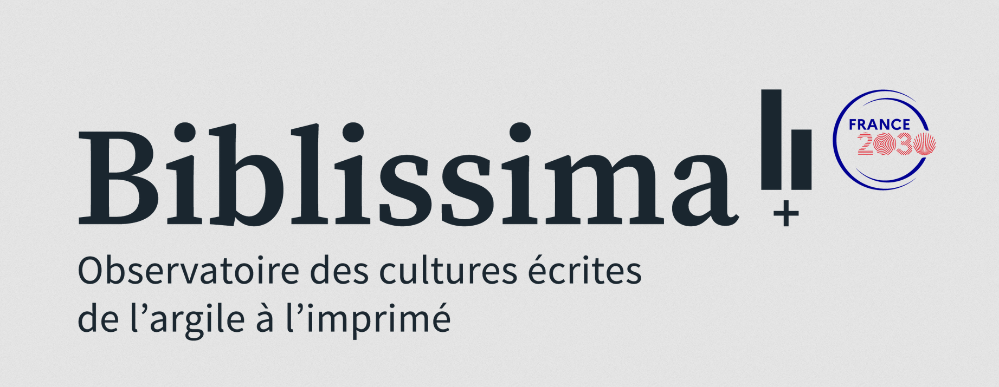

  

# 📜 Multilingual alignment and collation of the *De Regimine Principum* in Latin and vernacular 🌍

<!--  -->

**Exploring sentence segmentation and textual alignment across medieval Romance and Latin texts.**

This project brings together historical linguistics, digital humanities, and NLP to tackle a central challenge: how to process and compare medieval texts written in different languages, scripts, and editorial traditions.  
We develop open datasets and tools for **sentence segmentation**, **text alignment**, and **cross-lingual analysis**, focusing on prose texts from the 13th to 16th centuries.

### 🏰 *A Mirror for Princes Across Borders*  
**_De Regimine Principum_: Transmission and Translation**

*De Regimine Principum* was translated into numerous vernaculars shortly after its original composition, reflecting its broad impact across medieval Europe. This project uses modern computational techniques to systematically compare these translations, aiming to address a significant gap in historical text analysis and digital philology.

## 📚 Research Background
This work on *De Regimine Principum* represents the second phase of a broader initiative to apply computational methods to multilingual textual traditions.  
The first phase, documented in the [Aquilign repository](https://github.com/ProMeText/Aquilign), focused on building tools for **segmentation**, **alignment**, and **collation**. These tools were tested on the *Lancelot* corpus and now provide the technical foundation for analyzing *De Regimine* across its diverse vernacular versions.

## 🎯 Goals

- Create **diverse and historically authentic training data** for historical NLP  
- Model **sentence and phrase segmentation** in multiple medieval languages  
- Enable **multilingual alignment** of parallel textual traditions  
- Develop tools for **textual collation** across versions and languages

## 🔍 Methodology

We integrate traditional philological approaches with digital humanities techniques:
- **Alignment and collation:** Creating a foundational collation table from the Latin texts for reference, followed by detailed multilingual comparisons.
- **Textual variant analysis:** Using manual and automated methods to explore textual differences.
- **Semantic embedding:** Applying the latest NLP technology to assess textual similarities and divergences.

## 📊 Results

Preliminary results are available on the [Multilingual Aegidius project page](https://prometext.github.io/Multilingual_Aegidius/).

## 💾 Data Overview

This section outlines how textual data was prepared and structured in the *Multilingual Aegidius* project.

## 🧩 Corpus Overview

The construction of the multilingual **corpus** involved several stages, combining both curated datasets and primary source texts. Each step in the pipeline is **modular**, **reproducible**, and designed for **extensibility**—enabling future applications across different authors, languages, or textual genres.

⚠️ All freely available texts used in this project and obtained through other open-access initiatives are included in this repository. However, due to editorial restrictions, certain materials cannot be shared publicly at this time.

---

## 🧠 Training Datasets for Segmentation and Alignment

To support the development of robust segmentation and alignment models, the project includes curated **training datasets** located in the following directories:

- [`data/segmentation_data`](https://github.com/ProMeText/Multilingual_Aegidius/tree/main/data/segmentation_data)  
  Annotated datasets for sentence and phrase segmentation. These resources are used to train and evaluate models that detect linguistic units across historical languages.

- [`data/alignment_data/bibles`](https://github.com/ProMeText/Multilingual_Aegidius/tree/main/data/alignment_data/bibles)  
  Biblical texts in multiple medieval and modern languages, used to train alignment models. These structured and parallel datasets offer high-quality multilingual data for cross-lingual learning.

📄 **Documentation**  
For detailed dataset guidelines, see:  
- [Segmentation Dataset Documentation](docs/segmentation_corpus.md)  
- [Alignment Dataset Documentation](docs/alignement_corpus.md)

---

## 📂 Core Aegidius Corpus

The [`data/aegidius`](https://github.com/ProMeText/Multilingual_Aegidius/tree/main/data/aegidius) directory contains the core multilingual **text corpus** for this project. It features versions of *De Regimine Principum* in several medieval languages, supporting research in:

- Historical linguistics  
- Machine translation  
- Philological analysis

### 📄 Contents:
- Parallel texts in Latin, French, English, and more  
- Sentence-level alignments for comparative study  
- Metadata for sources and editions

This **corpus** forms the foundation of the preliminary results presented in the [Results](#) section.

## 🙏 Credits

We gratefully acknowledge the following scholars and institutions for their contributions of source material or expertise:

- **Pere Casanellas (Corpus Biblicum Catalanicum)** – Catalan biblical texts based on the Egerton, Peiresc, and Colbert manuscripts  
- **Claudio Lagomarsini** – Provided French texts of *Esther*, *Judith*, and *Ruth* (Bible du XIIIe siècle)  
- **Mouhamadoul-Khaly Wélé** – Multilingual aligned dataset based on the Quran  
- **Seth Middelton** – French transcription of the Gospel of *Matthew* (Bible du XIIIe siècle)  
- **Peter Stokes & Mark Faulkner** – Advice and recommendations regarding available Middle English corpora

## 📦 Models

Pretrained models and evaluation outputs will be published here as they become available.

📌 Stay tuned for Hugging Face links and downloadable checkpoints in future releases.

## 🤝 Contributing to the Project

Contributions to the project are highly encouraged, whether they be additional data, bug fixes, or enhancements to the analysis scripts. To contribute:

1. **Fork the Repository** – Start by forking the repository and cloning it locally.  
2. **Create a Branch** – Make your changes in a new branch named after the feature or fix.  
3. **Submit a Pull Request** – After pushing your changes to your fork, open a pull request for discussion and review.

---

## 💰 Funding

This work benefited from national funding managed by the **Agence Nationale de la Recherche** under the *Investissements d'avenir* programme with the reference **ANR-21-ESRE-0005 (Biblissima+)**.

> Ce travail a bénéficié d'une aide de l’État gérée par l’**Agence Nationale de la Recherche** au titre du programme d’**Investissements d’avenir** portant la référence **ANR-21-ESRE-0005 (Biblissima+)**.

## ⚖️ Licensing

This project is licensed under the [CC BY-NC-SA 4.0](https://creativecommons.org/licenses/by-nc-sa/4.0/) license.  
This license allows users to adapt, remix, and build upon the work non-commercially, as long as they credit the authors and license their new creations under the same terms.
