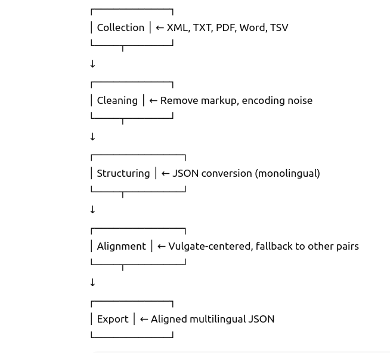
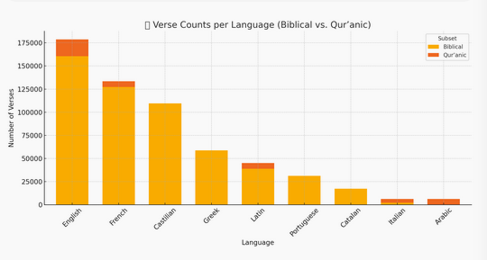
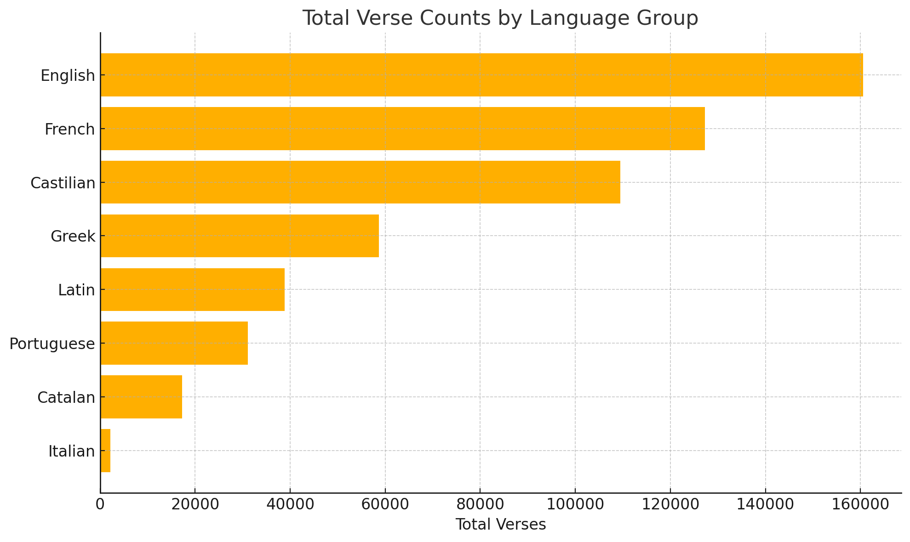

# 📘 Multilingual Alignment Dataset for Historical Texts


*Curated verse-aligned dataset to support multilingual NLP and historical-text alignment modeling.*

> A multilingual dataset of aligned biblical and Qur’anic texts, primarily in medieval languages, gathered from various external sources (see the [📂 Data Sources](#-data-sources) section). Select modern editions are included to enhance diversity and robustness. The dataset is designed to support training and evaluation of sentence alignment models for historical, philological, and comparative-linguistic use cases.
---


## 📂 Project Scope

This dataset provides training data for multilingual alignment models. It includes over **48,000 aligned verses** and over **4 million verse-level pairs**, covering **29 versions** in **9 languages**. The corpus spans both **medieval** and **modern** textual traditions.

It is intended as an **open, extensible training resource** for multilingual NLP, not a fixed benchmark. Future releases may add sources or metadata.

> 📌 Each aligned verse includes two or more versions. Pair counts reflect all *N choose 2* language pairs per verse.

---
## 🌟 Goals and Audience

<!-- The primary goal of this alignment corpus is to support the development and evaluation of multilingual alignment models tailored to historical texts.

Unlike standard parallel corpora, this dataset addresses specific challenges such as:

- Structural divergence across religious and textual traditions
- Free or flexible word order in premodern languages
- Non-standardized orthography and editorial conventions
- Gaps, mismatches, and overlaps in verse numbering

By providing aligned data across a diverse set of languages and time periods, the corpus aims to:

- Enable **robust training of sentence alignment systems** for historical and philological contexts
- Support research on translation shifts and **textual transmission in multilingual traditions**
- Offer a flexible and extensible foundation for further corpus-building or annotation efforts -->

This dataset aims to support the development and evaluation of multilingual alignment models tailored to **historical texts**, a niche often underserved by modern NLP resources.

Unlike standard parallel corpora, this dataset addresses challenges specific to historical-language contexts, such as:

- Structural divergence across traditions and textual lineages  
- Flexible or free word order in premodern languages  
- Non-standardized orthographies and inconsistent editorial practices  
- Gaps, mismatches, and overlap in verse segmentation across versions  

By providing aligned data across a diverse set of languages and time periods, the corpus aims to:

- Enable **robust training of sentence alignment systems** for historical and philological contexts
- Support research on translation shifts and **textual transmission in multilingual traditions**
- Offer a flexible and extensible foundation for further corpus-building or annotation efforts 

### 🎯 This dataset is designed for:
- NLP researchers working on low-resource or historical alignment tasks
- Digital humanists studying translation or textual variants 
- Scholars exploring textual transmission across religious or linguistic traditions

---

## 📊 Dataset Overview

| Feature            | 📖 Biblia Corpus                                                                                   | 🕋 Qur’anic Corpus                                                                 |
|--------------------|---------------------------------------------------------------------------------------------------|------------------------------------------------------------------------------------|
| **Text Types**     | Biblical texts (medieval + modern editions)                                                       | Qur’anic translations across historical European languages and Arabic             |
| **Languages**      | Latin, French, English, Castilian, Catalan, Italian, Portuguese, Greek                            | Arabic, Latin, English, French, Italian                                           |
| **Alignment Unit** | Verse-level (sentence or clause approximation)                                                    | Verse-level (surah:ayah)                                                          |
| **Format**         | JSON                                                                                              | JSON                                                                              |
| **Use Case**       | Training multilingual alignment models (not for scholarly textual criticism)                      | Training multilingual alignment models (not for religious or exegetical purposes) |
| **Aligned Verses** | 42,562 verses                                                                                     | 6,236 verses                                                                      |
| **Aligned Pairs**  | 3,927,811 pairs                                                                                   | 114,226 pairs                                                                     |

---
## 🔍 Challenges

### 🧩 Source Heterogeneity

- Modern Bibles are abundant online, but medieval ones are rare, sometimes only available in printed editions or inaccessible formats.
- Encoding inconsistencies and varying editorial norms require extensive normalization.

### ⚖️ Traditions and Variant Structures

- Medieval texts stem from diverse religious traditions, requiring careful textual literacy to align them responsibly.

- Canonical order and verse mapping vary significantly across traditions. Some books differ not only in name but also in structure — whether they are combined or split, reordered, expanded, or labeled differently across canons. These structural variations directly affect alignment decisions.

#### 🧱 Examples of Structural Differences

The following are just a few representative examples of structural differences that occur across traditions and directly impact how texts are aligned in the dataset:

- **Combined vs. Separate Books**
  - In the Latin Vulgate, *Ezra* and *Nehemiah* are titled *1 Esdras* and *2 Esdras*, respectively.
  - In the Septuagint, *1 Esdras* (*Esdras A*) is a distinct book that partially overlaps with *Ezra* and includes additional material (e.g., the "Three Bodyguards" story).
  - The Septuagint's *Ezra–Nehemiah* is presented as *2 Esdras* (*Esdras B*), aligning more closely with the Hebrew/Latin narrative but under a different naming system.

- **Additions and Rearrangements**
- *Daniel* includes additional materials — such as *Susanna*, *Bel and the Dragon*, the *Prayer of Azariah*, and the *Song of the Three Young Men* — which are present in both the Septuagint and the Latin Vulgate. However, their placement, chapter numbering, and structural treatment differ: for example, the *Prayer of Azariah* and the *Song* are inserted into Daniel 3 in the Septuagint, while the Vulgate includes them with separate headings and variable editorial presentation.

- **Different Chapter/Verse Divisions**
  - In some traditions, chapters or verses are split or merged differently (e.g., the *Epistle of Jeremiah* appears as **Baruch 6** in the Vulgate).
  - Psalm numbering varies across versions, complicating direct verse-to-verse comparison.

- **Supplemental or Non-Canonical Additions**
  - *Psalmus 151* is present in the Septuagint and in some later Latin Vulgate manuscripts, where it is occasionally labeled as apocryphal or appended outside the canonical Psalter. It has no standard position in the Latin tradition and is not consistently represented across witnesses.

- Even when books are nominally shared across traditions, structural divergences may prevent straightforward alignment.
  - ❗ Alignment in such cases requires detailed editorial work: verse splitting, content reordering, and managing interpolated sections. In some cases, texts may be excluded from alignment altogether if no counterpart exists in another tradition.

  - 
## 🛠️ Use and Limitations

⚠️ This dataset is intended **exclusively for training and evaluation purposes**.

It does **not preserve canonical verse numbering**, and is therefore **not suitable** for scholarly editions, canonical citation, or textual-critical research.

---

## 🤔 Alignment Principles

The following principles define how the dataset is structured and aligned across traditions, within the scope outlined above.

- **Anchor Text**: The Latin Vulgate serves as the primary reference for alignment due to its historical centrality and stable verse structure. However, when the Vulgate is unavailable for a particular book or verse, alignment is still performed using available language pairs from other traditions.

  - In some cases, a book is present in the Vulgate, but certain verses follow a divergent textual tradition (typically the Septuagint) in several witnesses. To account for this, we assign a modified reference (e.g., "3:03") to distinguish verses aligned to the LXX when no corresponding Latin text is available in the dataset. This approach ensures that valuable material is not discarded solely due to the absence of Latin, while still maintaining the minimum pairing requirement for alignment. Below is an example:
  - 
    ```json
    {
      "book": "nehemiae",
      "ref": "3:3",
      "data": {
        "la_vulgate": "portam autem Piscium aedificaverunt filii Asanaa ...",
        "gr_lxx": null,
        "en_wycliffe": "Forsothe the sones of Asamaa bildiden the yatis of fischis ...",
        "es_e6e8": "los fijos de assnaa fizieron la puerta delos peces ..."
      }
    },
    
    {
      "book": "nehemiae",
      "ref": "3:03",
      "data": {
        "la_vulgate": null,
        "gr_lxx": "καὶ τὴν πύλην τὴν ἰχθυηρὰν ᾠκοδόμησαν υἱοὶ Ασανα· ...",
        "en_coverdale": "But the Fyshporte dyd the children of Senaa buylde ...",
        "es_arragel": "& la puerta de los pesçes edeficaron los fiios de çanaa ..."
      }
    }
    ```

- **Minimum Pairing Requirement**: A verse or book is included only if at least one aligned counterpart exists in another tradition. In the context of this study, certain texts that are present in the dataset—such as IV Esdras in the Vulgate, 1 Esdras in the Septuagint, or 3–4 Maccabees in the Greek Orthodox canon—are excluded from alignment due to the absence of corresponding versions in the other included traditions. The corpus focuses strictly on comparative alignment between at least two textual witnesses.

- **Exclusions for Structural Complexity**: Certain books are excluded from the corpus due to major structural divergence and the high manual effort required for reliable verse mapping. For example, while the Septuagint version of *Esther* could, in principle, be partially aligned, doing so would entail substantial manual editorial work and require significantly more time.

- **Manual Alignment Adjustments**: In order to maintain consistent verse-level alignment across divergent textual traditions, manual intervention is sometimes required. This may involve splitting or shifting parts of a verse (e.g., moving a phrase or portion of it to an adjacent reference) to preserve structural correspondence. These interventions are strictly based on attested content already present in the dataset—never on reconstruction or invention. Patchwork alignment is permitted only when all segments involved are verifiably extant. All such editorial actions are recorded in separate documentation to ensure transparency and reproducibility.


---

# 📂 Data Sources

The Biblical and Qur’anic texts were selected for their **structural compatibility** — namely, their verse-based (or surah:ayah in the case of the Qur’an) organization — and their widespread **cross-linguistic transmission**, which enables meaningful alignment across centuries and traditions.


### 🕰️ Medieval Bibles

| Language | Text                        | Source                                                                                                                                                                           | Format        |
|----------|-----------------------------|----------------------------------------------------------------------------------------------------------------------------------------------------------------------------------|---------------|
| en       | John Wycliffe Bible         | [GitHub](https://github.com/saibotsivad/john-wycliffes-bible/tree/master/raw-text)                                                                                              | `.txt`        |
| en       | Coverdale Bible             | [GitHub](https://github.com/Isidore-Guild/coverdale)                                                                                                                             | `.xml`        |
| en       | Great Bible                 | [EDGeS Corpus](https://spraakbanken.gu.se/en/resources/openedges)                                                                                                                | `.tsv`        |
| it       | Gospel of St. Matthew       | [Caterina Menichetti Edition](https://www.sismel.it/pubblicazioni/2059-il-vangelo-secondo-matteo-in-volgare-italiano-studio-ed-edizione-critica-delle-due-versioni-non-glossate)            | `.pdf`        |
| fr       | La Bible historiale         | [Project site](https://www.biblehistoriale.fr/index.php/xml-tei/)                                                                                                                | `.xml`        |
| fr       | Esther, Judith, Ruth        |Texts kindly provided by Claudio Lagomarsini                                                                                                                                                | Word\*        |
| fr       | Gospel of Matthew           |Transcription kindly provided by Seth Middleton                                                                                                                                                | `.txt`\*      |
| gr       | Septuagint (LXX)            | [Corpus Corporum](https://mlat.uzh.ch/browser?path=/17098/17099/17113/17110/17104)                                                                                               | `.xml`        |
| es       | Three Medieval Bibles       | [Proyecto Biblia Medieval](https://bibliamedieval.es/recursos/textos)                                                                                                            | `.txt`        |
| ca       | Three Medieval Bibles       | Texts kindly provided by Pere Casanellas [(Corpus Biblicum Catalanicum)](https://cbcat.abcat.cat/)                                                                                                       | `.xml`, Word\*|
| la       | Vulgata Sixto-Clementina    | [GitLab](https://gitlab.com/crosswire-bible-society/vulgate/-/blob/master/vulgate.osis.xml?ref_type=heads)                                                                      | `.xml`        |

> \* *These texts are not publicly shareable due to copyright restrictions.*

---

### 📅 Modern Editions

Nine Bibles in French, English, Portuguese, Greek, and Spanish from [this repository](https://github.com/thiagobodruk/bible), used to augment language diversity.

---

### 🕋 Qur’an

Multilingual alignment produced by the **[Coran 12-21](https://coran12-21.org/fr) project** — co-directed by **Mouhamadoul-Khaly Wélé and Tristan Vigliano** — covering 7 languages (Arabic, Latin, English, French, Italian, etc.), with texts kindly provided by Mouhamadoul-Khaly Wélé.
*Note: This resource is not publicly redistributable.*

---
# 🧱 Data Structure

### 📘 Monolingual JSON
Each monolingual file is a **JSON dictionary** where each key is a book name, and each value is a list of verse objects ({`ref`, `text`})
```json
{
  "malachias": [
    {
      "ref": "1:1",
      "text": "Carga dela palabra del sennor a israel en mano de malechias:"
    }
  ]
}
```
### 🌍 Multilingual JSON

The multilingual aligned file is a **JSON list of dictionaries**, where each entry represents a verse with a `book`, a `ref`, and a `data` dictionary mapping version IDs to their corresponding translations (or `null` if missing).


```json
[
  {
    "book": "genesis",
    "ref": "1:2",
    "data": {
      "la_vulgate": "terra autem erat inanis...",
      "gr_lxx": "ἡ δὲ γῆ ἦν ἀόρατος...",
      "en_coverdale": "...",
      "fr_historiale": "...",
      "it_beta": null
    }
  }
]
```


### 📘 Structure Summary

| Format               | Structure                            | Scope               | Use Case                     |
|----------------------|---------------------------------------|----------------------|------------------------------|
| **Monolingual JSON** | `{ book: [ {ref, text} ] }`          | One language         | Intermediate/raw input       |
| **Multilingual JSON**| `[ {book, ref, data} ]`              | Aligned versions     | Final aligned corpus         |

**Field Definitions:**

- `book`: Book name (in lowercase)  
- `ref`: Canonical verse reference in `chapter:verse` format  
- `data`: Dictionary mapping version IDs to verse text (or `null` if missing)

---

## ⚙️ Alignment Workflow (Biblical Corpus)

`Import ➝ Structure ➝ Filter ➝ Align (to Vulgate) ➝ Export`




This corpus was prepared through a multi-stage alignment pipeline, designed to handle heterogeneous formats and historical variation.

### **Steps:**

1. **Collection**  
   - Source formats include XML, TXT, PDF, Word, and TSV  
   - Texts were selected for having existing verse-based divisions  
   - No orthographic normalization was performed — original spellings are preserved

2. **Cleaning**  
   - Removal of non-textual artifacts, markup noise, and encoding issues  
   - TEI/XML files were simplified or minimally processed for structure

3. **Structuring**  
   - Conversion into a unified JSON schema  
   - Monolingual JSON files prepared per text, then merged into multilingual alignment files  
   - Metadata added for book names, references, and version IDs

4. **Alignment**  
   - Verse-level alignment centered on the Latin Vulgate when available  
   - Where the Vulgate lacked a verse, alignment was constructed from available pairs  
   - Only verse units with at least one valid cross-language pair were retained

5. **Export**  
   - Final outputs include monolingual and multilingual JSON files  
   - Missing verses are represented with `null` values for transparency  

---

## 📈 Dataset Statistics Summary

### 📖 Biblia Corpus

**Multilingual** — — **3,927,811 pairs across 42,562 aligned verses**

> 📌 The number of aligned pairs refers to verse-level combinations between two or more languages.  
> Each verse aligned between *N* languages generates *N choose 2* pairings.

### 🕋 Qur’anic Corpus

**Multilingual (Qur’an)** — — **114,226 pairs across 6,236 aligned verses**

> 📌 The number of aligned pairs refers to verse-level combinations between two or more languages.  
> Each verse aligned between *N* languages generates *N choose 2* pairings.




## 📊 Dataset basic stats
###  Verse Counts by Version
> 📌 A "version" corresponds to a specific translation or manuscript tradition in a given language.


| Version ID        | Language     | Verses |
|-------------------|--------------|--------|
| gr_modern_greek   | Greek        | 31,060 |
| la_vulgate        | Latin        | 38,843 |
| fr_lsegond        | French       | 31,102 |
| fr_bible13        | French       |   702  |
| pt_almeida        | Portuguese   | 31,106 |
| es_arragel        | Castilian    | 22,652 |
| es_e6e8           | Castilian    | 31,247 |
| en_wycliffe       | English      | 36,248 |
| ca_peiresc        | Catalan      | 17,245 |
| en_bbe            | English      | 31,063 |
| en_coverdale      | English      | 31,086 |
| en_kjv            | English      | 31,059 |
| es_reina          | Castilian    | 31,065 |
| fr_jerusalem      | French       | 31,207 |
| it_alpha          | Italian      |  1,070 |
| fr_historiale     | French       |  2,241 |
| es_e3             | Castilian    | 24,515 |
| it_beta           | Italian      |  1,070 |
| gr_lxx            | Greek        | 27,616 |
| fr_perret         | French       | 31,102 |
| fr_epee           | French       | 30,933 |
| en_great          | English      | 31,108 |

**Multilingual** — — **3,927,811 pairs across 42,562 aligned verses**

> 📌 The number of aligned pairs refers to verse-level combinations between two or more languages.  
> Each verse aligned between *N* languages generates *N choose 2* pairings.


### 📊 Distribution by Language

The following plot summarizes the **total number of verses grouped by language**, aggregating across all available versions:

> 📌 This visualization complements the per-version table by offering a clearer view of data coverage **per language**, helping identify underrepresented areas or strong alignments.




### 🕋 Qur’anic Data

A multilingual alignment of the Qur’an (6,236 verses) was also used in model training. It includes **7 languages**, such as Arabic, English, French, Latin, and Italian. However, this data is **not included in the public release** due to redistribution restrictions.

> Qur’anic verses are structurally consistent and verse-aligned by design, contributing valuable contrast to biblical sources in the training setup.


## 🔍 Alignment Preview (Biblical Corpus)

The snippet below illustrates how to explore aligned verse pairs in the JSON file.  
Each verse contains a `book`, `ref`, and a `data` dictionary mapping version IDs to verse translations.

```python
import json

with open("aligned_data.json") as f:
    data = json.load(f)

# Display all aligned French–Portuguese verse pairs from Genesis
# 💡 Change language IDs below based on your alignment interest
for verse in data:
    if verse["book"] == "genesis":
        fr = verse["data"].get("fr_lsegond")
        pt = verse["data"].get("pt_almeida")
        if fr and pt:
            print(f'{verse["ref"]}:\nFR: {fr}\nPT: {pt}\n')
```
Note: aligned_data.json is not distributed due to licensing.
Use this example to preview the data format and structure.

---


### 🔮 Future Directions

This corpus is an initial foundation intended to grow. Several improvements are planned to enhance its usability, accuracy, and scholarly value:

- Prioritize the **collection and structuring of additional medieval texts**, especially from **Romance-language traditions**, to rebalance the dataset—currently skewed toward modern sources—and progressively specialize it for historical modeling. This will improve alignment robustness for premodern domains and enable the training of models tailored to medieval textual data.

- **Incorporate OCR/HTR of manuscript texts**  
  Leveraging Optical Character Recognition (OCR) and Handwritten Text Recognition (HTR) will allow the inclusion of otherwise inaccessible sources, especially for underrepresented medieval texts not available in digital editions.

- **Annotate editorial provenance and textual lineage**  
  Metadata will be enriched to reflect the textual origin (e.g., manuscript family, editor, edition), enabling philological and stemmatic analysis across traditions.

- **Develop a queryable interface or API**  
  To support broader reuse and exploration, develop a queryable interface or lightweight CLI tool is under consideration, allowing users to search and extract aligned verses by book, chapter, language pair, or version — without requiring users to load the full dataset into memory

### 🗂️ Versioning

- **Current version**: `v0.1`  
- **Next planned update**: Continued cleaning and integration of additional medieval texts already sourced — targeted for **Q4 2025**


### 📜 License

Corpus annotations and alignment metadata are distributed under [CC BY-NC-SA 4.0](https://creativecommons.org/licenses/by-nc-sa/4.0/), unless otherwise noted. Some source texts are not redistributable due to third-party copyright restrictions.
